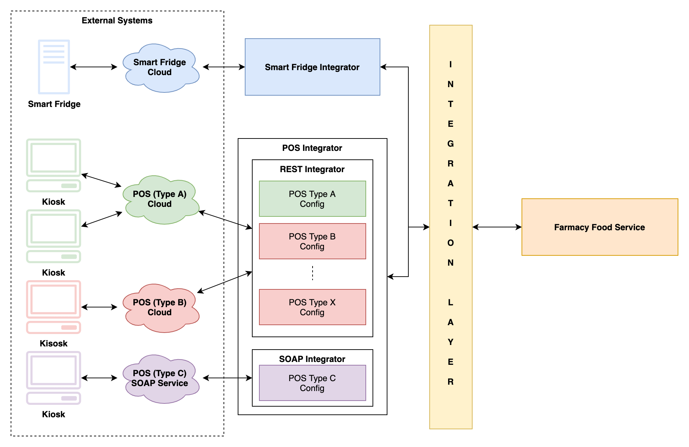

# Integration with the Points of Sale (Smart Fridge & Kiosks)

## Status
_ACCEPTED_

## Context
The meals provided by Farmacy foods can be sold from multiple Points of Sale:
1. Smart Fridges
2. Kiosks or Manual Points of Sale

We need to integrate with all the different points of sale for the following functionalities:
- Updating the changes in the Menu (Prices, New Meals)
- Updating the Promotional Coupons
- Fetching the Active status of POS
- Fetching the Inventory Available at a POS
- Fetching the purchases made at a POS

As there are multiple types of systems involved, we need to come with the design to easily integrate with all the currently active POS and also provide the capability to easily add new POS types.

For example, there are multiple softwares used for the Points of Sale like: Square POS, Shopify, Lightspeed, Quickbooks, Oracle micros and more.

## Decision
As we are partnering with Byte Technology for the Smart Fridges, We can assume that we will be majorly using this Smart Fridge as one of our Points of Sale. So, it is important that we make sure **this integration is done as an independent component** so that it can be scaled and maintained easily.

So, we can split into the following components:
1. Smart Fridge Integrator: To integrate with all the Smart Fridges of Byte Technology.
2. Kiosk Integrator: To integrate with all the Kiosks / Manual Points of Sale.

The different options for communicating with the POS systems:
1. REST API -> Fetch data from the POS System APIs
2. REST API -> Configure API callbacks in the POS Systems.
3. SOAP Services -> Fetch data from the POS System SOAP webservices.

As the integrator has to continuously be available to communicate with the Smart Fridge / POS Systems, the intergrator should be developed as **micro-services** and should not follow the Serverless design which we will be using for our other components.

Communication:
1. Inventory updates will be done using direct API communication with the internal services.
2. All other communications between the integrators and the internal services will be asynchronous using an Event driven design.

## Consequences
Advantages:
1. Smart Fridge integrator component can be independently scaled.
2. Connect with multiple POS Systems with less redundant code.
3. Single point of integration with internal services.
4. High Availability due to use of micro-services approach.

Disadvantages:
1. Some redundant code between the Smart Fridge and POS Integrators.
